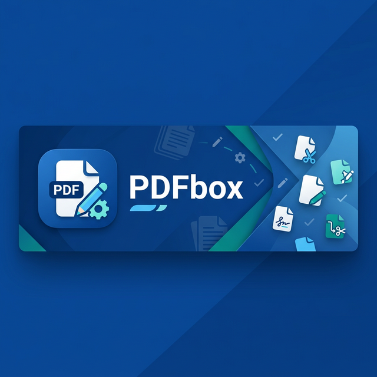

# PDFbox 📄

<p align="center">
  
</p>

<p align="center">
  
  
  
  
  
</p>

**PDFbox** is a professional-grade, lightweight, and powerful PDF editor for Android. Built with a focus on simplicity and efficiency, it provides a comprehensive suite of tools to manage, modify, and secure your PDF documents on the go.

---

## ✨ Key Features

- ⛓️ **Merge PDFs:** Effortlessly combine multiple PDF files into a single document.
- ✂️ **Split PDFs:** Extract specific pages or split a large PDF into smaller parts.
- 🗜️ **Compress PDFs:** Reduce file size without compromising quality for easy sharing.
- 🔄 **Rotate Pages:** Fix orientation issues by rotating individual or all pages.
- 🔒 **Secure with Lock:** Protect your sensitive documents with password encryption.
- 🖼️ **Extract Images:** High-quality image extraction from any PDF document.
- 📁 **Recent Files:** Quick access to your recently edited documents via a smart localized database.
- 🔍 **Global Search:** Find any document in seconds with our optimized search engine.

---

## 🛠️ Tech Stack & Architecture

PDFbox is built using modern Android development best practices and high-performance libraries:

- **Language:** Kotlin & Java (Multi-paradigm approach)
- **UI Framework:** Jetpack Compose & XML (Hybrid for performance and flexibility)
- **Design System:** Material Design 3 (Clean, Flat, and Modern UI)
- **PDF Engine:** 
  - [PDFBox-Android](https://github.com/TomRoush/PdfBox-Android) for robust PDF manipulation.
  - [AndroidPdfViewer](https://github.com/mhviewsoft/AndroidPdfViewer) for high-speed document rendering.
- **Database:** Room Persistence Library for local history management.
- **Image Loading:** Glide for efficient asset handling.
- **Architecture:** MVVM (Model-View-ViewModel) for clean separation of concerns.

---

## 🚀 Getting Started

### Prerequisites

- Android Studio Koala | 2024.1.1 or newer
- JDK 17
- Android SDK 36 (Compile SDK)
- Minimum SDK: API 24 (Android 7.0)

### Installation

1. **Clone the repository:**
   ```bash
   git clone https://github.com/shejanahmmed/PDFbox.git
   ```
2. **Open in Android Studio:**
   - Go to `File -> Open` and select the cloned directory.
3. **Build the project:**
   - Wait for Gradle sync to complete and press the `Run` button.

---

## 👤 Author

**Farjan Ahmmed (Shejan)**
*Software Engineering Student at Daffodil International University*

- 📧 **Email:** [farjan.swe@gmail.com](mailto:farjan.swe@gmail.com)
- 🔗 **LinkedIn:** [Farjan Ahmmed](https://www.linkedin.com/in/farjan-ahmmed/)
- 🐙 **GitHub:** [@shejanahmmed](https://github.com/shejanahmmed)
- 🌐 **Socials:** [Facebook](https://www.facebook.com/beingshejan/) | [Instagram](https://www.instagram.com/iamshejan/)

📍 *Dhaka, Bangladesh*

---

## 📄 License

This project is licensed under the **MIT License** - see the [LICENSE](LICENSE) file for details.

---

<p align="center">Made with ❤️ for the Android Community</p>
